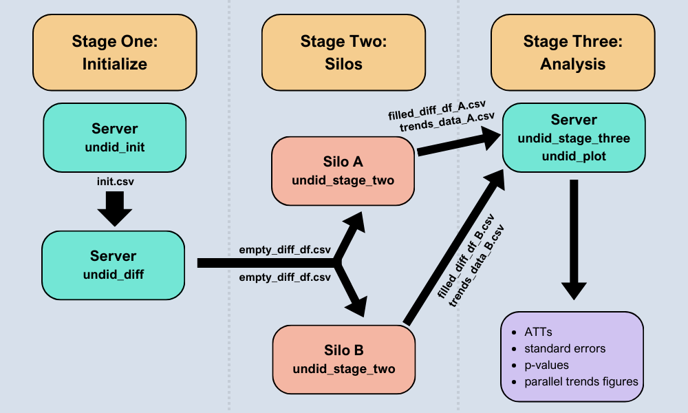

# undid
A framework for estimating difference-in-differences with unpoolable data, based on [Karim, Webb, Austin, and Strumpf (2024)](https://arxiv.org/abs/2403.15910v2). Supports common or staggered adoption, multiple groups, and the inclusion of covariates. Also computes p-values for the aggregate average treatment effect on the treated via the randomization inference procedure described in [MacKinnon and Webb (2020)](https://doi.org/10.1016/j.jeconom.2020.04.024).



## Warning: Package Under Development

Please note that this package is under active development and a few features are not yet implemented:
- plotting capabilites
- updated sthlp files and documentation

## Installation
```stata
net install undid, from("https://raw.githubusercontent.com/ebjamieson97/undid/main/")
```
### Update
```stata
ado uninstall undid
net install undid, from("https://raw.githubusercontent.com/ebjamieson97/undid/main/")
```

## Requirements
* **Stata**: Version 16 or later

## Stage One: Initialize

#### 1. `undid_init` - Creates an initial CSV file (`init.csv`) and displays its filepath

Generates an initial CSV file (`init.csv`) specifying the silo names, start times, end times, and treatment times. This file is then used to create the `empty_diff_df.csv`, which is to be sent to each silo.

Control silos should be marked with `"control"` in the `treatment_times` argument.

Covariates may be specified when calling `undid_init` or when calling `undid_diff`.

Ensure that dates are all entered in the same date format, a list of compatible date formats can be seen [here.](#compatible-date-formats)

**Parameters:**

- **silo_names** (*string*):  
  A string specifying the different silo names. Silo names should be separated by spaces, e.g. `silo_names("Ontario Quebec")`.
  
- **start_times** (*string*):  
  A string which indicates the starting time for the analysis at each silo.

- **end_times** (*string*):  
  A string which indicates the end time for the analysis at each silo.

- **treatment_times** (*string*):  
  A string which indicates the treatment time at each silo. Control silos should be labelled with the treatment time `"control"`.

- **covariates** (*string, optional*):  
  A string specifying covariates to be considered at each silo.

- **filename** (*string, optional*):  
  A string specifying the outputted filename. Must end in `.csv`. Defaults to `"init.csv"`.

- **filepath** (*string, optional*):  
  A string specifying the path to the folder in which to save the output file. e.g. `` "`c(pwd)'" ``. Defaults to `` "`c(tempdir)'" ``

```stata
* For the case of many silos, as is shown here, it may be practical to create the initial 
* CSV file in Excel, Sheets, or any other similar program.

undid_init , ///
    silo_names("71 58 64 59 85 57 72" ///
               " 61 34 88" ///
               " 11 12 13 14 15 16 21" ///
               " 22 23 31 32 33 35 41" ///
               " 42 43 44 45 46 47" ///
               " 51 52 53 54 55 56 62" ///
               " 63 73 74 81 82 83 84" ///
               " 86 87 91 92 93 94 95") ///
    start_times("1989") ///
    end_times("2000") /// match treatment times to appropriate silos in the same order 
    treatment_times("1991 1993 1996 1997 1997 1998 1998" ///
                    " 1999 2000 2000" ///
                    " control control control control control control control" ///
                    " control control control control control control control" ///
                    " control control control control control control" ///
                    " control control control control control control control" ///
                    " control control control control control control control" ///
                    " control control control control control control control") ///
    covariates("asian black male") ///
				   filepath("`c(pwd)'")

init.csv saved to: C:\Users\Eric Bruce Jamieson\Documents\My Cool undid Files\init.csv

```

#### 2. `undid_diff` - Creates the CSV file to be sent out to each silo (`empty_diff_df.csv`) and displays its filepath

Creates the `empty_diff_df.csv` which lists all of the differences that need to calculated at each silo in order to compute the aggregate ATT. The `empty_diff_df.csv` is then to be sent out to each silo to be filled out.

**Parameters:**

- **init_filepath** (*string*):  
  A string specifying the filepath to the `init.csv`.
  
- **date_format** (*string*):  
  A string which specifies the [date format](#compatible-date-formats) used in the `init.csv`. 

- **freq** (*string*):  
  A string which indicates the length of the time periods to be used when computing the differences in mean outcomes between periods at each silo and the length of a period for the trends data. Options are:
  - `year month week day years months weeks days`

- **covariates** (*string, optional*):  
  A string specifying covariates to be considered at each silo. If left blank uses covariates from `init.csv`. 

- **freq_multiplier** (*integer, optional*):  
  Specify if the frequency should be multiplied by a non-zero integer. For example, if the time periods to consider are two years, set `freq("years") freq_multiplier(2)`.

- **weights** (*string, optional*):
  A string indicating the type of weighting to use in the case of common adoption. Defaults to "standard". Options are:
  - "standard" weighs each silo according to: (num of obs after and at the treatment period) / (num of obs)

- **filename** (*string, optional*):  
  A string specifying the outputted filename. Must end in `.csv`. Defaults to `"init.csv"`.

- **filepath** (*string, optional*):  
  A string specifying the path to the folder in which to save the output file, e.g. `` "`c(pwd)'" ``. Defaults to `` "`c(tempdir)'" ``.

```stata
undid_diff, filepath("C:/Users/Eric Bruce Jamieson/Documents/My Cool undid Files/init.csv") date_format("yyyy") freq("year")

empty_diff_df.csv saved to: C:\Users\Eric Bruce Jamieson\Documents\My Cool undid Files\empty_diff_df.csv
```


## Stage Two: Silos

#### 3. `undid_stage_two` - Creates an two CSV files (filled_diff_df_silo_name.csv and trends_data_silo_name.csv) and displays their filepaths

Based on the information given in the `empty_diff_df.csv`, computes the appropriate differences in mean outcomes at the local silo and saves as `filled_diff_df_silo_name.csv`. 

Note that the `time_column` should reference a string variable. This is in order to facilitate passing date information between Stata and Julia. 

Further, covariates at the local silo should be renamed to match the spelling used in the `empty_diff_df.csv`. 

Ensure that the local silo data is loaded as Stata's active dataset before running `undidjl_stage_two`. 

**Parameters:**

- **empty_diff_filepath** (*string*):  
  A string specifying the filepath to the `empty_diff_df.csv`.
  
- **silo_name** (*string*):  
  A string which specifies the local silo's name as it is written in the `empty_diff_df.csv`. 

- **time_column** (*varname*):  
  A string which indicates the name of the variable in the local silo data which contains the date information. This variable should be a string. 

- **outcome_column** (*varname):  
  A string specifying the name of the variable in the local silo data which contains the outcome of interest.

- **silo_date_format** (*string*):  
  A string specifying the [date format](#compatible-date-formats) used in the `time_column` variable. 
  
- **consider_covariates** (*int, optional*):  
  An integer which if set to 0 (false) ignores computations involving the covariates specified in the `empty_diff_df.csv`. Defaults to 1 (true) 

- **filepath** (*string, optional*):  
  A string specifying the path to the folder in which to save the output file, e.g. `` "`c(pwd)'" ``. Defaults to `` "`c(tempdir)'" ``.

- **anonymize_weights** (*int, optional*):
  An integer which if set to 1 (true) will round all the counts of observations (n) and counts of post-treatment observations (n_t)
  associated with each contrast to the nearest multiple of **anonymize_size**. Defaults to 0 (false). 

- **anonymize_size** (*int, optional*):
  An integer which defines to the value to be rounded to should **anonymize_size** be toggled on. Defaults to 5. 

```stata
* An analogous script would be run at each silo 
use "tests\\test_dta_files\\State71.dta", clear
tostring year, replace
undid_stage_two, empty_diff_filepath("test_csv_files\empty_diff_df_staggered.csv") silo_name("71") time_column(year) outcome_column(coll) silo_date_format("yyyy") filepath("`c(pwd)'")

filled_diff_df_71.csv saved to
C:/Users/User/Current Folder/filled_diff_df_73.csv
trends_data_71.csv saved to
C:/Users/User/Current Folder/trends_data_73.csv
```

## Stage Three: Analysis

#### 4. `undid_stage_three` - Computes and displays UNDID results (aggregate ATT, standard errors, p-values)

Takes in all of the `filled_diff_df_silo_name.csv`'s and uses them to compute the aggregate ATT and standard errors. 

The `agg` parameter specifies the aggregation method used in the case of staggered adoption. By default it is set to `"g"` so that the ATTs are aggregated across the various treatment times, but can be set to any of `"g"`, `"gt"`, `"silo"`, `"sgt"`, `"time"`, `"none"`. 

For common adoption scenarios, the valid aggregation methods are `"silo"` and `"none"` (as there is only one treatment time so there are not multiple sub-aggregate ATTs to be calculated for each treatment time). 

**Parameters:**

- **dir_path** (*string*):  
  A string specifying the filepath to the folder containing all of the `filled_diff_df_silo_name.csv`'s.
  
- **agg** (*string, optional*):  
  A string which specifies the aggregation methodology for computing the aggregate ATT. Either `"silo"`, `"g"`, `"gt"`, `"sgt"`, `"time"`, or `"none"`. Defaults to `"g"`.

- **weights** (*string, optional*):
  A string, one of: `"none"`, `"diff"`, `"att"`, or `"both"`. Defines if weights should be applied when computing the sub-aggregate ATTs and/or when computing the aggregate ATT (or neither). Defaults to the weighting method that was specified in the `empty_diff_df.csv` file. 

- **covariates** (*int, optional*):  
  An integer, either 0 (false) or 1 (true) which specifies whether to use the `diff_estimate` (0) or the `diff_estimate_covariates` (1) column when computing the aggregate ATT. Defaults to 0.

- **use_pre_controls** (*int, optional*):
  An integer, either 0 (false) or 1 (true). If set to true, computations will use contrasts (diffs) from pre-treatment periods of treatment silos as controls where applicable. Defaults to 0 (false).

- **nperm** (*int, optional*):
  An integer, defines the number of random permutations to consider for the randomization inference procedure. Defaults to 1001. 

- **verbose** (*int, optional*):
  An integer, either 0 (false) or 1 (true), which if set to 1 (true) will display progress messages as the randomization inference procedure is being executed. Defaults to 1 (true).

- **seed** (*int, optional*):
  An integer which allows you to set the seed for the randomization inference procedure. If set to 0, does not set a seed. Defaults to 0.


```stata
undid_stage_three, dir_path("C:/Users/User/Documents/Files From Silos")

-----------------------------------------------------------------------------------------------------
                                     undid: Sub-Aggregate Results                    
-----------------------------------------------------------------------------------------------------
Sub-Aggregate Group       | ATT             | SE     | p-val  | JKNIFE SE  | JKNIFE p-val | RI p-val
--------------------------|-----------------|--------|--------|------------|--------------|---------|
1991                      |0.0529100        | 0.022  | 0.017  | 0.024      | 0.030        |.|
--------------------------|-----------------|--------|--------|------------|--------------|---------|
1993                      |0.0235928        | 0.017  | 0.155  | 0.019      | 0.204        |.|
--------------------------|-----------------|--------|--------|------------|--------------|---------|
1996                      |0.0564351        | 0.024  | 0.021  | 0.029      | 0.057        |.|
--------------------------|-----------------|--------|--------|------------|--------------|---------|
1997                      |0.0711167        | 0.023  | 0.002  | 0.027      | 0.009        |.|
--------------------------|-----------------|--------|--------|------------|--------------|---------|
1998                      |0.0485436        | 0.033  | 0.143  | 0.039      | 0.213        |.|
--------------------------|-----------------|--------|--------|------------|--------------|---------|
1999                      |0.0120440        | 0.015  | 0.424  | 0.021      | 0.561        |.|
--------------------------|-----------------|--------|--------|------------|--------------|---------|
2000                      |-0.0330623       | 0.032  | 0.308  | 0.096      | 0.732        |.|
--------------------------|-----------------|--------|--------|------------|--------------|---------|

------------------------------
   undid: Aggregate Results
------------------------------
Aggregation: g
Weighting: both
Aggregate ATT: .04317447
Standard error: .00803168
p-value: .00170286
Jackknife SE: .00867386
Jackknife p-value: .00250789
RI p-value: 

```

#### 7. `undid_plot` - Plots parallel trends figures

Combines all of the `trends_data_silo_name.csv` files and uses this data to plot trends 

**Parameters:**

- **dir_path** (*string, required*):  
  A string specifying the filepath to the folder containing all of the `trends_data_silo_name.csv`'s.

```stata
undid_plot, 
```


### Appendix

#### Compatible Date Formats
- `ddmonyyyy` → 25aug1990
- `yyyym00` → 1990m8
- `yyyy/mm/dd` → 1990/08/25
- `yyyy-mm-dd` → 1990-08-25
- `yyyymmdd` → 19900825
- `yyyy/dd/mm` → 1990/25/08
- `yyyy-dd-mm` → 1990-25-08
- `yyyyddmm` → 19902508
- `dd/mm/yyyy` → 25/08/1990
- `dd-mm-yyyy` → 25-08-1990
- `ddmmyyyy` → 25081990
- `mm/dd/yyyy` → 08/25/1990
- `mm-dd-yyyy` → 08-25-1990
- `mmddyyyy` → 08251990
- `yyyy` → 1990